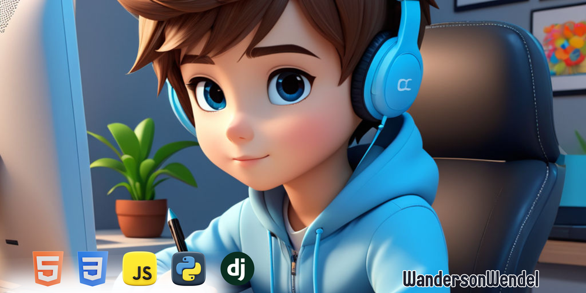

   Graduando em Análise e Desenvolvimento de Sistemas(UFC) 

## Aqui, você vai encontrar: 

####  Projetos/Atividades acadêmicas.  
####  Projetos durante meus estudos e práticas com Front-End.

  
   
  
    

## Minha Stack Principal

## Sobre mim 

-  Olá! Meu nome é Wanderson Wendel e sou um Desenvolvedor Front-end.  
-  Meu objetivo atual é conseguir meu primeiro emprego/estágio e com o tempo, adiquirindo conhecimento, me tornar um ótimo desenvolvedor. 
-  Conhecimento acadêmico em JavaScript, TypeScript, React, Next.js e Kotlin. 
-  Procuro sempre ser uma pessoa educada e respeitosa, e adoro interagir com novas pessoas. 
-  Além deste mundo da tecnologia, curto muito o mundo geek, como Marvel. Você também? Mande uma mensagem, vamos conversar!  

<!-- -  Check out my [portfolio](https://portfolio-chi-lemon-51.vercel.app/)! -->

 

## Contatos

<!-- -->

<picture align="center">
  <source media="(prefers-color-scheme: dark)" srcset="https://raw.githubusercontent.com/wandersonwendel/wandersonwendel/output/github-contribution-grid-snake-dark.svg">
  <source media="(prefers-color-scheme: light)" srcset="https://raw.githubusercontent.com/wandersonwendel/wandersonwendel/output/github-contribution-grid-snake-dark.svg">
  
</picture>
